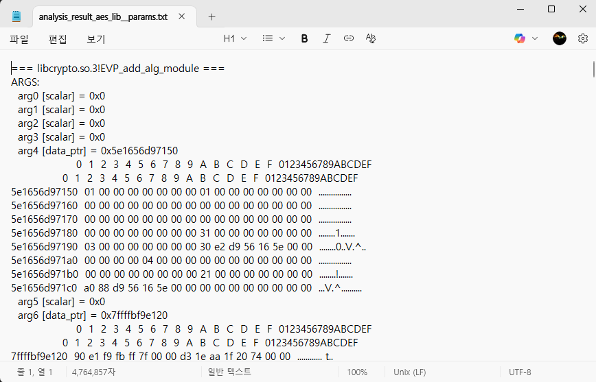
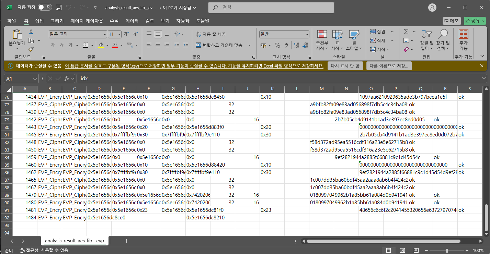

## 동적 분석 수행

정적 분석에서 얻은 환경 정보로 동적 분석 수행해야 할 것으로 판단

agent.js 파일에서 필터링을 하지 않으면 모든 함수에 후킹

## 작동 방식, Frida-core 원리

추가 예정...

## 사용 방법

예제 실행파일 aes_lib (test_code 활용)

```
uv run python3 main.py aes_lib
python3 print_params.py analysis_result_aes_lib.json 

# 1. 동적 분석 실행
uv run python3 main.py aes_lib

# 2. 상세 파라미터 확인 (선택)
python3 print_params.py analysis_result_aes_lib.json

# 3. EVP API CSV 추출 (주요 결과물)
python3 extract_evp.py analysis_result_aes_lib.json

# 4. 필터링된 요약 보기 (선택)
python3 filter_trace.py analysis_result_aes_lib.json
```


### 테스트 결과

#### 상세 파라미터 출력 결과 (TXT)


#### EVP API 추출 결과 (CSV)


- 함수 파라미터와 반환값
    - EVP_CipherInit_ex: 암호화 컨텍스트 초기화 함수의 모든 파라미터 캡처
    - EVP_EncryptUpdate: 실제 암호화 수행 함수의 입출력 데이터 캡처
    - 포인터 주소, 데이터 길이, 실제 데이터 값 모두 정확히 추출
- 완전한 암호화 과정 추적
    - 1479번: 32바이트 AES-256 키 + 16바이트 IV로 암호화 컨텍스트 초기화  
    - 1481번: "Hello, AES encryption with OpenSSL!" 텍스트를 실제 암호화 (ASCII로 변환하면 원본 텍스트 복원됨)  
- OpenSSL EVP API의 전체 암호화 워크플로우가 완벽히 추적됨

동적 분석 통해서 암호화 함수의 중요 정보(키, IV, 평문, 암호문)를 실시간으로 캡쳐  
agent.js에서 필터링하지 않으면 모든 함수의 정보를 가져오며, 결과 파일이 최대 80만줄 가까히 늘어남 (필터링으로 생성자와 소멸자를 거르도록 하면 원본 로그의 앞뒤 내용이 크게 잘려나가고 random값 가져오는 부분부터 나오는것 확인 가능하지만, 그래도 로그의 양이 많은 상태)

- 결과물의 양이 많아서 결과물을 먼저 가져오고 그 이후 판단하는데 어려움이 있음 (지금은 먼저 필터링하는것으로 해결했으나, 정적 분석에서 판단하는것과 크게 다른점이 없다고 생각됨)
- 난독화된 상황이라면 무엇을 근거로 암호화에 관련된 함수라는것을 판단할 수 있을까? 
- 난독화된 상황이어도 동적분석 과정에서 함수명이 항상 보이는건지, 그리고 동적분석으로 정확히 어떤 정보를 가지고 와서 판단해야 하는건지, 연산 과정의 값을 가지고 오면 예측이 가능할거라고 생각되지만 어떻게 가져와야 하는지
- 동적 분석이 불가능한 상황도 있나


